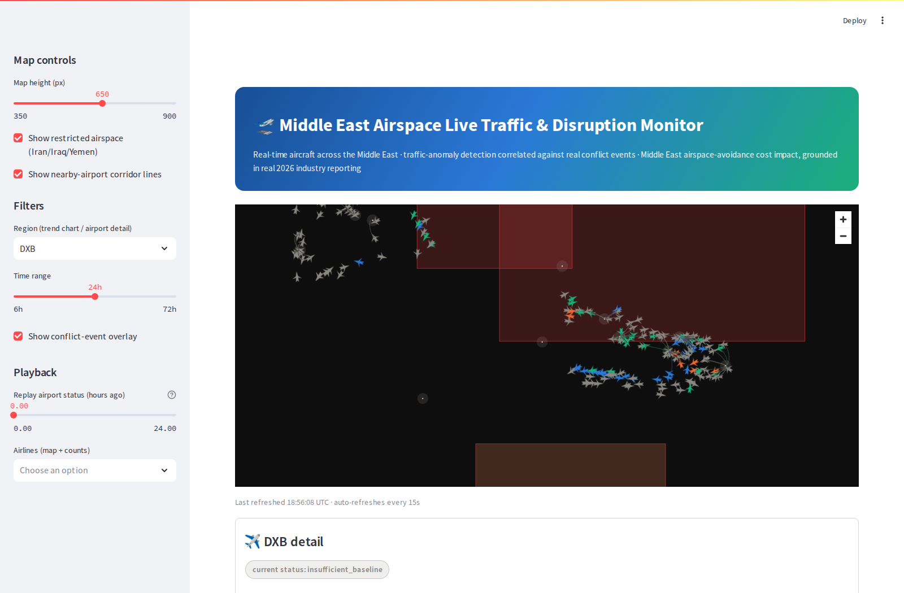

# Middle East Airspace Live Traffic & Disruption Monitor


A cloud-native AWS streaming pipeline that tracks **real, live aircraft**
across the Middle East (OpenSky Network), detects traffic anomalies against
a rolling per-region baseline, and correlates disruptions with **real GDELT
conflict-event data** — plus a cost-impact estimate for Iran/Iraq airspace
avoidance grounded in cited 2026 industry reporting. Free to run end to end
(no AWS account or Docker required).



## What it does

1. **Polls OpenSky Network's `/states/all`** every run for real live aircraft
   positions across the Middle East, and pulls **GDELT Event Database v2**
   bulk exports for real, ongoing conflict events in the same region.
2. Streams ingested state vectors through a real **Kinesis** stream (OpenSky
   is poll-based, not push — this models "streaming" honestly as
   poll → durable stream → consumer) into an S3 data lake (bronze → silver →
   gold, medallion-style).
3. Computes a **rolling per-region traffic baseline** and flags anomalies
   (`insufficient_baseline` / `normal` / `warning` / `serious` / `critical`),
   distinguishing a traffic **spike** (often ordinary — e.g. Hajj/Umrah
   season) from a **drop** (the operationally meaningful disruption signal),
   and correlates drops against real nearby GDELT conflict events.
4. Serves everything through DynamoDB (two GSIs purpose-built for "every
   flagged region right now" and "conflict events near region X in this time
   window") and a Streamlit dashboard: a live pydeck radar map with
   rotated, airline-colored aircraft, restricted-airspace overlays, nearby
   -airport corridor lines, a historical status-playback slider, Power BI
   -style KPI cards, and a real cost-impact estimate for airspace avoidance.
5. All of it is defined as real Terraform against a real AWS API surface —
   see "Key design decisions" below for exactly what that means and doesn't
   mean.

## Why this exists

Two sibling portfolio projects
([crypto-streaming-pipeline](https://github.com/codykhalifa88-sys/crypto-streaming-pipeline),
[ecommerce-data-warehouse](https://github.com/codykhalifa88-sys/ecommerce-data-warehouse))
prove real-time streaming and batch ETL/warehousing fundamentals without
cloud infrastructure, and
[ev-charging-gap-analysis](https://github.com/codykhalifa88-sys/ev-charging-gap-analysis)
proves cloud-native architecture and IaC on a batch pipeline. This project
is the fourth piece: a genuinely **streaming** cloud-native pipeline (real
Kinesis, not just S3), plus anomaly detection and multi-source geo/time
correlation — a bigger data-engineering scope, still built without spending
money on a real AWS account or needing Docker in the dev environment.

The original concept was a Gulf-region flight-price tracker, but Amadeus's
free self-service tier was decommissioned and Kiwi's Tequila API is now
invitation-only — neither is viable as a free, honest, primary data source.
The pivot to live traffic-anomaly detection is both more honest (no
dependency on a dead/gated API) and a bigger, more visually compelling
project: a genuinely live map is the centerpiece, not a static chart.

## Key design decisions

- **Kinesis is the real streaming backbone, and it's genuinely exercised
  against moto** (real `PutRecords`/`GetRecords`/shard semantics, not a
  metadata stub) — unlike Step Functions/Glue/Athena/EventBridge, it needs
  no `enable_x` gate. OpenSky itself is a poll API, not push, so
  "streaming" is modeled honestly as poll → durable stream → consumer,
  which is exactly the problem Kinesis solves.
- **The live map polls OpenSky directly, bypassing the backbone.** Showing
  current aircraft positions is already what `/states/all` returns —
  routing it through Kinesis/S3/DynamoDB first would only add latency for
  zero benefit. That backbone exists to build history (traffic volume over
  time, the rolling anomaly baseline, GDELT correlation), a genuinely
  different job. If the direct poll fails or is rate-limited, the map falls
  back to the most recent bronze S3 object with an honest "cached" label.
- **pydeck over Plotly for the map.** `IconLayer` supports per-point
  rotation (`get_angle` from real `true_track`/heading) — the one feature
  that makes this read as ATC radar instead of a scatter plot. Plotly's
  `scattermapbox` needs a Mapbox token; `scattergeo` has no street/terrain
  tiles at all. pydeck gets a free, no-token dark basemap via CARTO.
- **Spike vs. drop, surfaced separately.** A traffic spike is often
  perfectly ordinary (real seasonal Hajj/Umrah demand into JED); a drop is
  the operationally meaningful "possible disruption" signal. Conflating the
  two would treat a legitimate surge as equally suspicious as a genuine
  collapse — see `docs/data_dictionary.md` for the full threshold table.
- **A traffic bucket exists only when a poll actually happened.** Never a
  resample/reindex that backfills a `0` for a missed or late scheduled run
  — that would silently manufacture fake traffic-collapse anomalies out of
  ordinary scheduling lag.
- **Real, cited cost-impact figures, not invented numbers.** The
  Iran/Iraq-airspace-avoidance cost estimate applies real 2026
  industry-reporting figures (SimpleFlying, The National, EASA guidance,
  aerospaceglobalnews.com — full citations in
  `pipeline/reference/restricted_airspace.py` and
  `docs/data_dictionary.md`), explicitly labeled as an illustrative
  estimate, not a precise per-flight measurement.
- **GDELT's `ActionGeo_CountryCode` is FIPS 10-4, not ISO** (confirmed:
  Iraq is `IZ`, not ISO's `IQ`) — kept as a display field only, never used
  for filtering, since the lat/long bounding-box filter is more precise.
- **moto, not LocalStack** — same reasoning as the ev-charging-gap-analysis
  sibling: LocalStack's free tier now paywalls Step Functions/Glue/Athena/
  Redshift/EventBridge and requires Docker regardless. moto is pure Python,
  needs no Docker, and genuinely supports everything this pipeline needs,
  including Kinesis's real shard/record semantics.

See `docs/architecture_diagram.md` for the full data-flow diagram and the
real-vs-moto-vs-real-AWS-only breakdown, and `docs/data_dictionary.md` for
full schemas, the anomaly-threshold table, and every source-data gotcha
found while building this.

## Results (from a real run)

A real pipeline run against live data on 2026-07-28 produced:

- **231** real live aircraft state vectors tracked across the Middle East
  bounding box in a single poll (Emirates, Etihad, Qatar Airways, Saudia,
  Turkish Airlines, and dozens more real airlines by ICAO callsign)
- **35** real GDELT conflict events (`QuadClass >= 3`) inside the Middle
  East bounding box in that same 15-minute GDELT snapshot
- Real-time cost-impact estimate: **$210,000–$580,000** in estimated extra
  fuel cost for currently-tracked flights on airlines named in 2026
  reporting as avoiding Iranian/Iraqi airspace
- 15 Middle East airports tracked (Gulf/GCC plus Egypt, Jordan, Lebanon,
  Israel, Iraq, Syria, Iran), 3 restricted-airspace overlays

**Known, honestly-stated limitation**: the rolling anomaly baseline needs 12
consecutive 5-minute buckets (1 hour) of real accumulated history per region
before it reports anything besides `insufficient_baseline` — this
sandbox has no free persistent AWS account, so `scheduled_refresh.yml`'s CI
runs each start from a fresh, empty moto instance rather than accumulating
history across runs (see `docs/data_dictionary.md`'s "Known limitation"
section). The screenshots and history shown in this repo were accumulated by
running the pipeline repeatedly against a long-lived local moto instance
during development; a real AWS deployment's persistent DynamoDB has no such
limitation.

Real bugs found and fixed while actually running this (not aspirational —
each one only showed up once real data/infra/UI was exercised):
- moto 5.0.11 lacks `describe_limits` for Kinesis, which Terraform's AWS
  provider calls when creating `aws_kinesis_stream` — fixed by upgrading to
  moto 5.2.2.
- pydeck's `IconLayer` `sizeUnits` prop didn't translate correctly through
  a snake_case→camelCase kwarg (`size_units="pixels"`), producing an
  `undefined` value in the WebGL shader that silently broke icon sizing —
  every aircraft rendered as a giant, screen-filling color splotch instead
  of a small rotated plane glyph. Fixed by dropping the redundant prop
  (pixels is already the default unit) and using a single `get_size` value.
- Streamlit's `st.markdown` auto-renders `$...$` as inline LaTeX (KaTeX) by
  default — the cost-impact section's real dollar figures (`$6,000+`,
  `$1 billion`) were being silently parsed as math spans and rendered
  garbled. Fixed by escaping every `$` in that markdown block.
- A real DynamoDB test-isolation bug: synthetic test rows written under
  real airport codes (e.g. `DXB`) with tz-naive timestamps leaked into the
  shared, session-scoped test table and mixed with the real pipeline's
  tz-aware timestamps for that same region — sorting the resulting
  mixed-tz-awareness column crashed pandas. Fixed by using obviously-fake,
  non-colliding region codes in the new DynamoDB integration tests.
- The GDELT events table was silently missing real events that landed more
  than 150km from every named airport (`nearest_region="OTHER"`, genuine
  open-water/overflight conflict events) — the dashboard's query loop only
  iterated named airports. Fixed by including `"OTHER"` in the query list.
- Widening the tracking bbox from Gulf-only to the full Middle East
  legitimately pulled in a real conflict event near Amman that the
  narrower box had excluded — required updating hardcoded test-count
  assertions (`3` → `4`) after manually confirming it was a real, correct
  inclusion, not a bug.

## Running locally

```bash
python3 -m venv .venv --without-pip   # or `python3 -m venv .venv` if pip works out of the box
curl -sL https://bootstrap.pypa.io/get-pip.py | .venv/bin/python
.venv/bin/pip install -r requirements.txt

./scripts/fetch_terraform_binary.sh    # portable static binary, no sudo/apt needed

cp .env.example .env

.venv/bin/moto_server -p 5000

cd infra && ../bin/terraform init && ../bin/terraform apply -var-file=environments/moto.tfvars && cd ..

python -m orchestrator.run_pipeline     # runs against live OpenSky/GDELT data

streamlit run dashboard/app.py
```

Optional: register a free OpenSky account and set `OPENSKY_CLIENT_ID`/
`OPENSKY_CLIENT_SECRET` in `.env` for a longer rate-limit runway (anonymous
access works fine without it — see `.env.example`).

## Tests

```bash
pytest tests/unit -v          # pure functions, real fixtures, no network/moto
pytest tests/integration -v   # spins up its own moto_server + terraform apply on a separate port
```

## Data sources & licensing

- [OpenSky Network](https://opensky-network.org) — live aircraft state vectors, public API terms
- [GDELT Event Database v2](https://www.gdeltproject.org) — free and open for any use
- Restricted-airspace zones and cost-impact figures: see citations in
  `pipeline/reference/restricted_airspace.py` and `docs/data_dictionary.md`

See `data/samples/README.md` for exact capture dates and file provenance.

## Project structure

```
gulf-airspace-traffic-monitor/
├── pipeline/           ingest / transform / serving modules, config, reference data
├── orchestrator/       hand-rolled local pipeline runner (no Airflow/Step Functions locally)
├── infra/              Terraform (moto-backed locally, real-AWS migration path documented)
├── dashboard/          Streamlit app (live map, KPI cards, anomaly trend, cost impact)
├── tests/unit/         pure-function tests, real fixtures, no AWS
├── tests/integration/  real moto_server + terraform apply, separate port/state from dev
├── scripts/            portable Terraform fetch, plane-icon generator
├── docs/               architecture diagram, data dictionary, screenshot
└── data/samples/       trimmed real data snapshots + provenance
```

## Stretch goals (not implemented — documented, not attempted)

- [ ] Glue Crawler + Athena named query over the gold layer
      (`infra/glue_athena.tf`, behind `enable_glue_athena` — not exercised
      against moto)
- [ ] Seasonal/weekday-aware anomaly baseline (needs weeks of real history;
      the current baseline is honestly recency-only, see
      `docs/data_dictionary.md`)
- [ ] Real EventBridge Scheduler → Step Functions execution (needs a real
      AWS account; `.github/workflows/scheduled_refresh.yml`'s 5-minute
      cron is the working local equivalent)
- [ ] Precise FIR-boundary restricted-zone polygons in place of the current
      simplified rectangular bounding boxes
