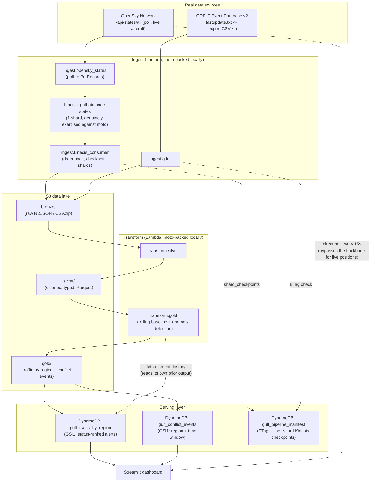

# Architecture

## Two different jobs, not one pipeline forcing both

The **live map polls OpenSky directly from the Streamlit process** on every
autorefresh tick — showing current aircraft positions is already what
`/states/all` returns, so routing it through S3 → Kinesis → DynamoDB first
would only add latency for zero benefit. The **Kinesis → S3 → DynamoDB
backbone exists to build history**: traffic-volume-over-time, the rolling
anomaly baseline, and GDELT correlation — a genuinely different job. If the
direct poll fails or is rate-limited, the map falls back to the most recent
bronze S3 object with an honest "cached" freshness label.

## What's real vs. moto-backed vs. real-AWS-only

| Piece | Status |
|---|---|
| S3, DynamoDB, Lambda (create), IAM | Real service semantics via moto — genuinely tested (S3 put/get, DynamoDB queries/GSIs, `terraform apply` creating real resources) |
| **Kinesis** | Genuinely exercised against moto — real `PutRecords`/`GetRecords`/shard semantics, not a metadata stub. No `enable_x` gate needed, unlike the resources below |
| Lambda **execution** | Not exercised — moto can't run Lambda code without Docker. The orchestrator calls the same plain Python functions directly instead (thin-handler/pure-core split, see `pipeline/ingest/*.py`) |
| Step Functions, EventBridge Scheduler, Glue, Athena | Defined in Terraform (`infra/stepfunctions.tf`, `infra/eventbridge.tf`, `infra/glue_athena.tf`) as the real-AWS migration path — never applied against moto (gated by `enable_real_aws_orchestration` / `enable_glue_athena`, both default `false`) |
| Scheduling | `.github/workflows/scheduled_refresh.yml`'s cron (every 5 minutes) is the real, working stand-in — it actually fires and runs the real pipeline against live data |

## Why Kinesis, not just S3 directly

OpenSky is a **poll API, not a push/streaming one** — there's no webhook or
subscription. "Streaming" here is modeled honestly as
poll → durable stream → consumer, which is exactly the problem Kinesis
solves: it decouples the poller (which must run frequently and briefly) from
the consumer (which drains, checkpoints per shard via
`pipeline/manifest.py`'s `shard_checkpoints`, and writes one durable bronze
file per run), rather than writing directly to S3 and losing shard-level
replay semantics.

## Why pydeck, not Plotly, for the live map

`st.pydeck_chart`'s `IconLayer` supports per-point rotation (`get_angle`
driven by real `true_track`/heading) — the one feature that makes the map
read as ATC radar instead of a scatter plot. Plotly's `scattermapbox` needs a
Mapbox token for a real basemap; `scattergeo` has no street/terrain tiles at
all. pydeck gets a free, no-token dark basemap via CARTO
(`pdk.map_styles.DARK`) and is core Streamlit API, not an extra heavy
dependency.

## Why moto, not LocalStack

Same reasoning as the ev-charging-gap-analysis sibling: LocalStack's free
Community tier paywalls Step Functions/Glue/Athena/Redshift/EventBridge and
requires Docker regardless (unavailable in this project's dev environment).
moto is pure Python, needs no Docker, and genuinely supports everything this
pipeline exercises functionally — including Kinesis's real shard/record
semantics, which this project relies on more heavily than the sibling did.
